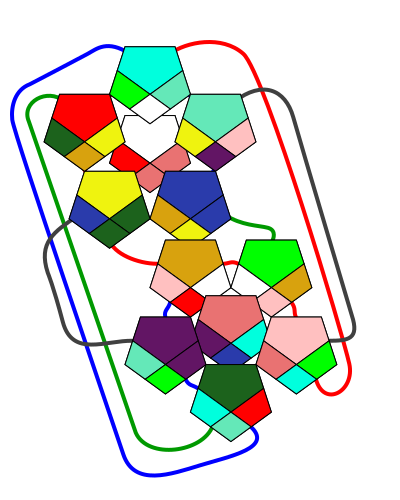

# puzzle-solver-regular-dodecahedron

Creating a tool that solves the puzzle I have. It is similar to a rubik's cube, but instead of a cube it is a "regular dodecahedron"

## How to serve app:

- `npm install`
- `npm run build` when code changes
- `npm run serve`
- then open http://127.0.0.1:8080/

## How to run app while developing:

- `npm install`
- `npm run watch` will listen for changes in ts files and rebuild
- `npm run serve` so you can open http://127.0.0.1:8080/

## Images

Actual current state of my toy:

## References:

- [Svg element that I used](https://www.w3schools.com/graphics/svg_polyline.asp)
- [How I chose the naming](https://en.wikipedia.org/wiki/Regular_dodecahedron)

## Naming:

- regular dodecahedron - the shape of this toy
- puzzleToy - variable name to use for the actual toy
- crease - the part where the toy moves. 4 of which this has
- face - the flat surface 12 of which this shape has
  - collateral face - a face that stays the same but moves to new location after rotating a specific crease.
